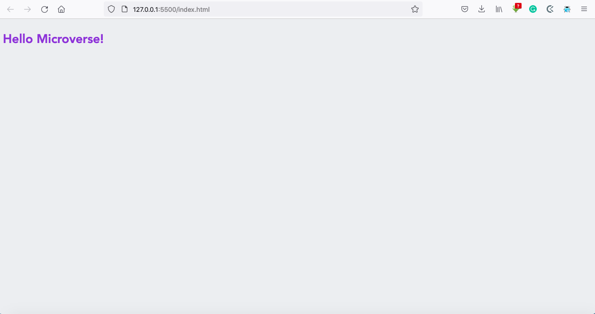

# Project Name

Hello Microverse Project

A simple HTML webpage to display the text "Hello Microverse!"

## Built With

- HTML
- CSS

## Live Demo

[View Demo here](https://raw.githack.com/t-yanick/hello-world/hello-microverse/index.html)

## Getting Started

To get a local copy up and running follow these simple example steps.

### Prerequisites

- Web browser

### Setup

Download or clone the project into a local directory

### Usage

Open the index.html file in the web browser

## Authors

👤 **Author**

- GitHub: [@t-yanick](https://github.com/t-yanick)
- Twitter: [@ElTazoh](https://twitter.com/ElTazoh)
- Linkedin: [tazoh-yanick](https://linkedin.com/in/tazoh-yanick)

## 🤝 Contributing

Contributions, issues, and feature requests are welcome!

Feel free to check the [issues page](https://github.com/t-yanick/hello-world/issues/).

## Show your support

Give a ⭐️ if you like this project!

## Acknowledgments

- Hat tip to anyone whose code was used
- Inspiration
- etc

## 📝 License

This project is [MIT](www.mit.org) licensed.